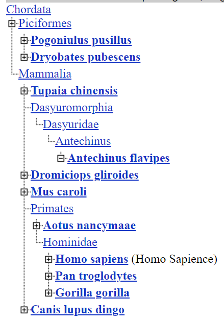

# Задание 2. Изучение представленности генов в таксонах

### 1.

человека и мышь - Euarchontoglires
человека и бабочку - Nephrozoa
человека и дрожжи - Opisthokonta
человека и капусту - Eukaryota

Ближайший к человеку - дизентерийная амеба, самый удаленный - ламинария сахаристая

### 2.

INS (Insulin)

### 3. 

### 4. 

| Gene Symbol |        Название вида |           русское название |
|-------------|----------------------|----------------------------|
|         INS |  Antechinus flavipes |   Желтоногая сумчатая мышь |
|         INS |      Aotus nancymaae | Западноамазонская мирикина |
|         INS |    Canis lupus dingo |                      Динго |
|        Ins1 |           Mus caroli |                 Мышь Рюкю? |
|         INS | Dromiciops gliroides |         Соневидный опоссум |
|         INS |  Dryobates pubescens |             Пушистый дятел |
|          TH |      Gorilla gorilla |                    Горилла |
|          TH |      Pan troglodytes |      Обыкновенный шимпанзе |
|         INS |  Pogoniulus pusillus |         Краснолобый медник |
|         INS |     Tupaia chinensis |                     Тупайя |

### 5.

[Alignment](alignment.aln-clustal_num)

### 6. 

Все выравнивание можно разделить на отдельные участки со своими особенностями

1. Последовательности для гориллы и шимпанзе значительно длиннее остальных, из-за чего много пропусков у остальных видов. У гориллы и шимпанзе выбранные гены почти идентичны

2. На этом участке у всех последовательностей очень высокое совпадение

3. Теперь только у человека, гориллы и шимпанзе

4. И в конце снова почти полное совпадение шимпанзе и гориллы

Выглядит так, что рассматриваемый ген включен в более длинную последовательность у гориллы и шимпанзе

Если посмотреть выравнивание без гориллы и шимпанзе, то видно, что остальные виды во много совпадают, кроме человека - у него последовательность длиннее

### 7.

Все найденные виды принадлежат хордовым