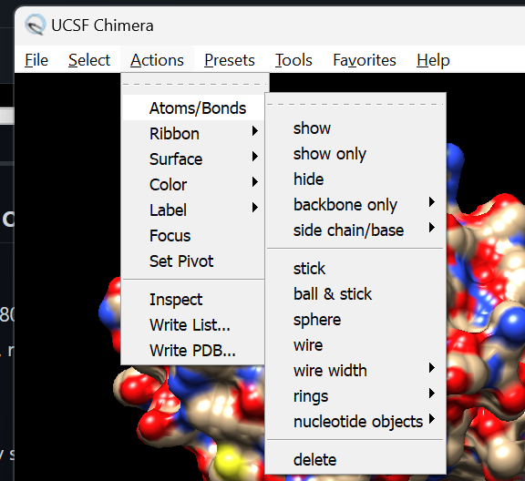
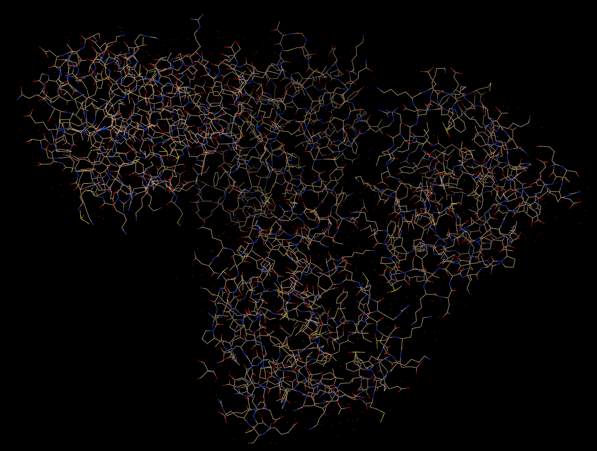
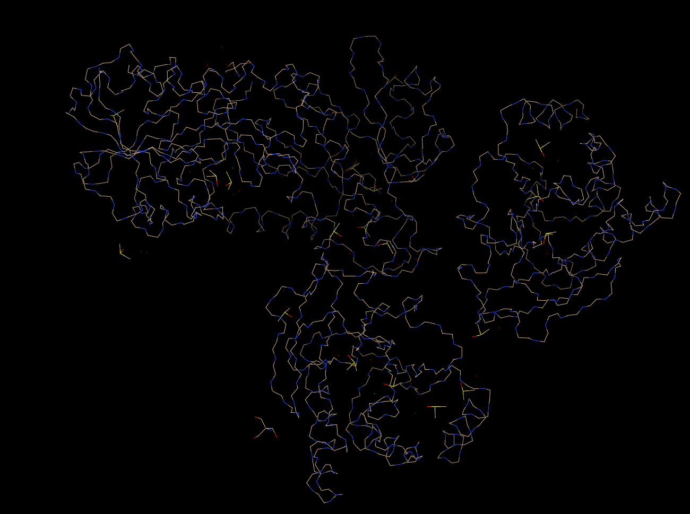
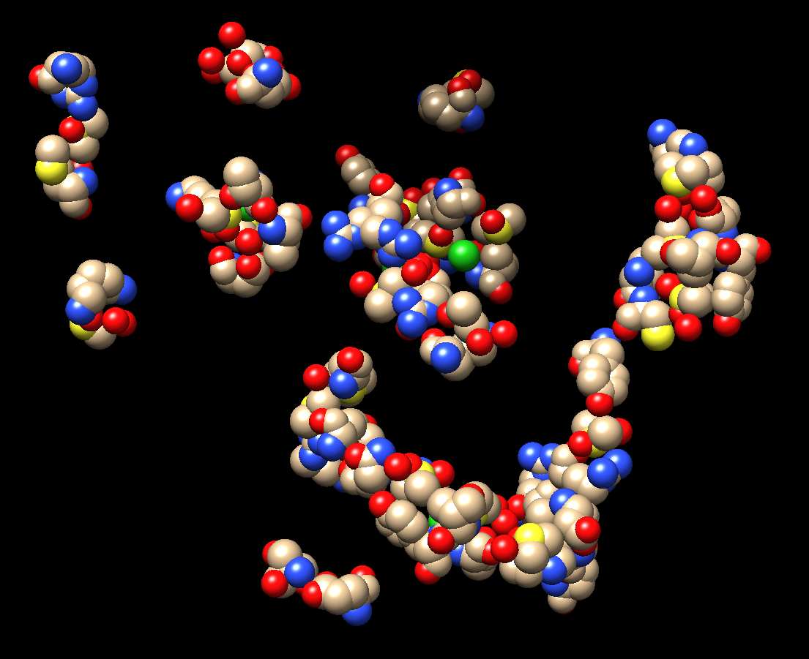
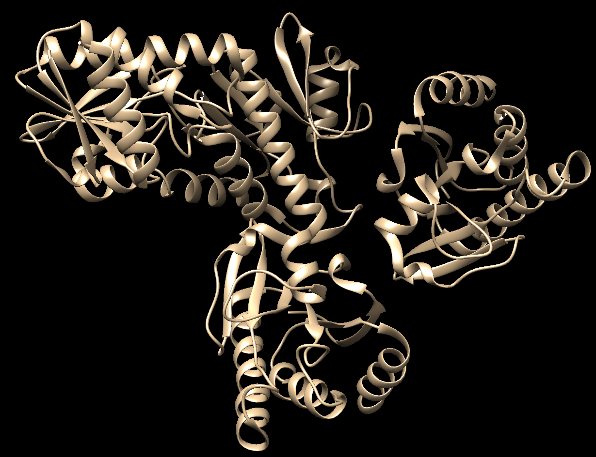
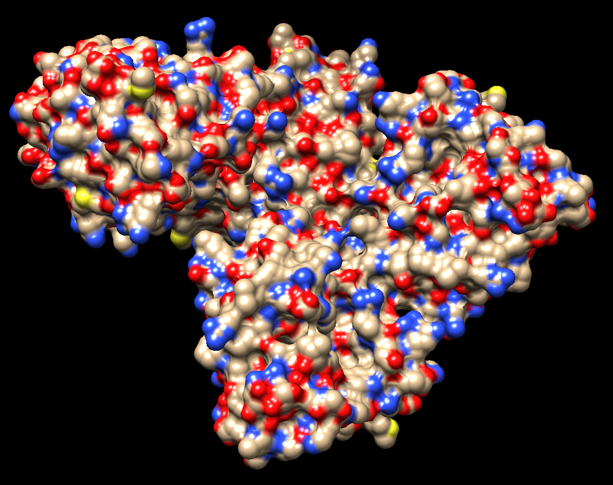
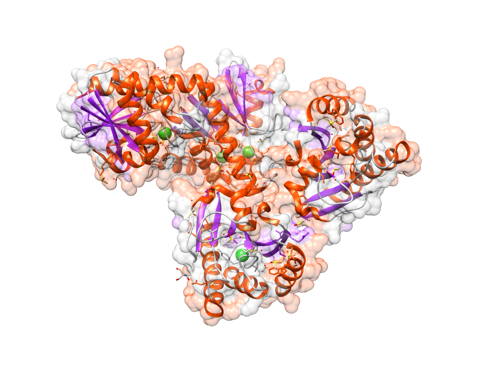

# Задание 3. Визуализация структуры белка
Использованное ПО - UCSF Chimera, структура белка https://www.rcsb.org/structure/7H6L

## Визуализация структуры

### Настройка визуализации

### Wireframe

Actions - Atoms/Bonds - Wire

### Backbone

Actions - Atoms/Bonds - backbone only - minimal

### Spacefill

Actions - Atoms/Bonds - sphere

### Ribbons

Actions - Ribbon - rounded

### Molecular surface

Actions - Surface - solid
Color - heteroatom

## Раскраска структуры

