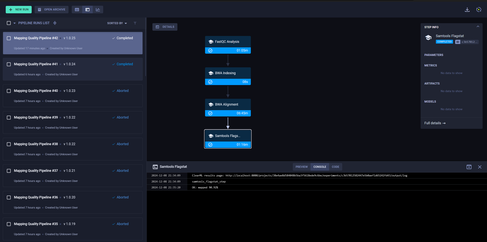

### 

1) [Риды](https://www.ncbi.nlm.nih.gov/sra/SRX26706482[accn])
[Референс](https://www.ncbi.nlm.nih.gov/assembly/GCF_000005845.2/)
2) [Скрипт bash](https://github.com/NikitaTrTr/Bioinformatics/blob/master/task4/get_percent_of_mapped.sh)
2.1) [Аналогично на python](https://github.com/NikitaTrTr/Bioinformatics/blob/master/task4/get_percent_of_mapped.py)
3) [Результаты samtools flagstat](https://github.com/NikitaTrTr/Bioinformatics/blob/master/task4/flagstat_results)
4) В скриптах из пункта 2) есть разбор результатов
5) Не уместились в ограничение 100мб на файл
6) Установить все, что описано в разделе "Требования к среде". Забавы ради приложил [полную историю bash](https://github.com/NikitaTrTr/Bioinformatics/blob/master/task4/bash_log) с первой попытки настройки. Во второй попытке сделано примерно то же на чистую систему.
7) [Простой пайплайн](https://github.com/NikitaTrTr/Bioinformatics/blob/master/task4/hello_clearml.py) 
8) [Его логи](https://github.com/NikitaTrTr/Bioinformatics/blob/master/task4/hello_clearml_log)
9)
10) [Алгоритм анализа на фреймворке](https://github.com/NikitaTrTr/Bioinformatics/blob/master/task4/pipeline.py)
11) [Результаты работы пайплайна](https://github.com/NikitaTrTr/Bioinformatics/blob/master/task4/pipeline_results)
12) [Логи пайплайна](https://github.com/NikitaTrTr/Bioinformatics/blob/master/task4/analysis_pipeline_log)
13) 

14) Использовал веб сервис сервера clearml. Отличается от блок-схемы меньшей детализацией - решается более мелким дроблением задач в пайплайне.

### Требования к среде
	В качестве системы использован WSL
Скачаны (установлены):
- sratoolkit (fastq-dump, prefetch) 
- bwa
- samtools
- fastqc
- Docker
- python 3

В среде python установлены:
- setuptools
- clearml
- clearml-agent

[Локальное развертывание clearml-server](https://clear.ml/docs/latest/docs/deploying_clearml/clearml_server_linux_mac)

### Запуск пайплайна
> clearml-agent daemon -d --queue default
> python pipeline.py reference.fna SRR31329025.fastq
	